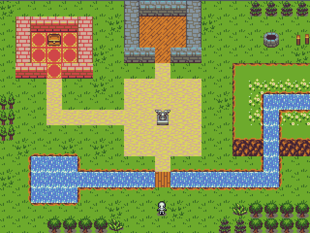

# SDLProject
RPG-like game created using the SDL2 library

## About
A simple RPG game created for the purpose of learning the SDL2 library as well as basic game development elements.

Tiled is used for creating the map.

## Screenshot

### Dependencies
- libsdl2-dev
- libsdl2-image-dev

#### Installation
~~~
$ make
~~~

#### References
Spritesheet used: https://opengameart.org/content/tiny-16-basic
